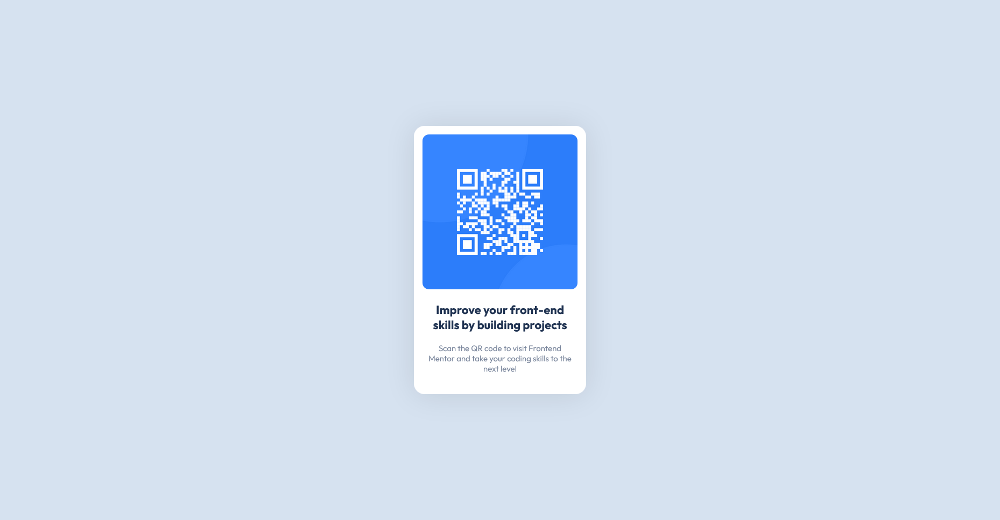

# Frontend Mentor - QR code component solution

This is a solution to the [QR code component challenge on Frontend Mentor](https://www.frontendmentor.io/challenges/qr-code-component-iux_sIO_H). Frontend Mentor challenges help you improve your coding skills by building realistic projects.

## Table of contents

- [Overview](#overview)
  - [Screenshot](#screenshot)
  - [Links](#links)
- [My process](#my-process)
  - [Built with](#built-with)
  - [What I learned](#what-i-learned)
  - [Continued development](#continued-development)
  - [Useful resources](#useful-resources)
- [Author](#author)
- [Acknowledgments](#acknowledgments)

**Note: Delete this note and update the table of contents based on what sections you keep.**

## Overview

### Screenshot



### Links

- Solution URL: [Add solution URL here](https://www.frontendmentor.io/solutions/qr-code-component-61rEiKdmgc)
- Live Site URL: [Add live site URL here](https://nikkehtine.github.io/frontend-mentor-qr-code-component/)

## My process

### Built with

- Semantic HTML5 markup
- CSS custom properties
- CSS Grid
- Mobile-first workflow

### What I learned

After some time of idling, I could revise some HTML and CSS, and have fun with problem solving.

Check out my usage of CSS variables and grid layout:

```css
body {
  font-family: Outfit, sans-serif;
  font-size: 15px;
  text-align: center;
  margin: 0;
  height: 100vh;
  display: grid;
  place-items: center;
  /* Variables */
  --width: 288px;
  --lgray: hsl(212, 45%, 89%);
  --gblue: hsl(220, 15%, 55%);
  --dblue: hsl(218, 44%, 22%);
}
```

### Useful resources

- [Centering in CSS - CSS-Tricks](https://css-tricks.com/centering-css-complete-guide/) - This article helped me with centering the card. It shows a bunch of ways to center elements with CSS.
- [box-shadow - MDN](https://developer.mozilla.org/en-US/docs/Web/CSS/box-shadow) - MDN is an amazing resource and helped me a lot.

## Author

- Frontend Mentor - [@nikkehtine](https://www.frontendmentor.io/profile/nikkehtine)
- Twitter - [@nikkehtine](https://www.twitter.com/nikkehtine)

## Acknowledgments

Thanks to [@WitchDevelops](https://github.com/WitchDevelops) for helping me and answering my questions!
